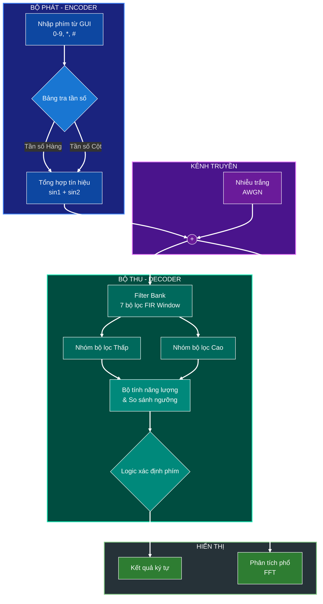

```mermaid
%%{init: {'theme': 'dark', 'themeVariables': { 'edgeLabelBackground':'#333', 'tertiaryColor': '#fff'}}}%%
graph TD
    %% --- ĐƯỜNG NỐI  --- %%
    linkStyle default stroke:#FFFFFF,stroke-width:2.5px,fill:none;
    
    %% --- KHỐI PHÁT (ENCODER) --- %%
    subgraph Transmitter [BỘ PHÁT - ENCODER]
        A[Nhập phím từ GUI <br> 0-9, *, #] --> B{Bảng tra tần số}
        B -- Tần số Hàng --> C[Tổng hợp tín hiệu <br> sin1 + sin2]
        B -- Tần số Cột --> C
    end

    %% --- KÊNH TRUYỀN --- %%
    subgraph Channel [KÊNH TRUYỀN]
        C --> D((+))
        E[Nhiễu trắng <br> AWGN] --> D
    end

    %% --- KHỐI THU (DECODER) --- %%
    subgraph Receiver [BỘ THU - DECODER]
        D --> F[Filter Bank <br> 7 bộ lọc FIR Window]
        F --> G[Nhóm bộ lọc Thấp]
        F --> H[Nhóm bộ lọc Cao]
        G --> I[Bộ tính năng lượng <br> & So sánh ngưỡng]
        H --> I
        I --> J{Logic xác định phím}
    end

    %% --- KẾT QUẢ --- %%
    subgraph Result [HIỂN THỊ]
        J --> K[Kết quả ký tự]
        D --> L[Phân tích phổ <br> FFT]
    end

    
    %% 1. Transmitter: Blue Navy
    style Transmitter fill:#1a237e,stroke:#448aff,stroke-width:2px,color:#fff
    style A fill:#0d47a1,stroke:#fff,color:#fff
    style B fill:#1976d2,stroke:#fff,color:#fff
    style C fill:#0d47a1,stroke:#fff,color:#fff

    %% 2. Channel: Deep Purple
    style Channel fill:#4a148c,stroke:#ea80fc,stroke-width:2px,color:#fff
    style D fill:#6a1b9a,stroke:#fff,color:#fff
    style E fill:#6a1b9a,stroke:#fff,color:#fff

    %% 3. Receiver: Deep Teal 
    style Receiver fill:#004d40,stroke:#1de9b6,stroke-width:2px,color:#fff
    style F fill:#00695c,stroke:#fff,color:#fff
    style G fill:#00695c,stroke:#fff,color:#fff
    style H fill:#00695c,stroke:#fff,color:#fff
    style I fill:#00897b,stroke:#fff,color:#fff
    style J fill:#00897b,stroke:#fff,color:#fff

    %% 4. Result: Slate Gray/Dark Green
    style Result fill:#263238,stroke:#81c784,stroke-width:2px,color:#fff
    style K fill:#2e7d32,stroke:#fff,color:#fff
    style L fill:#2e7d32,stroke:#fff,color:#fff
```
