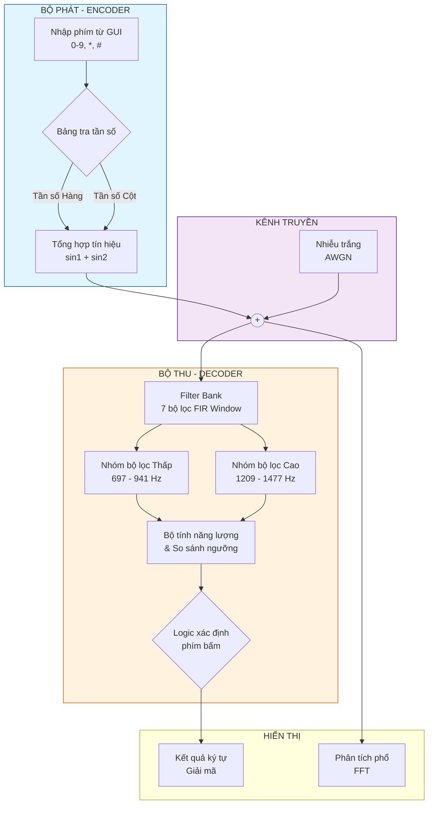

```mermaid
graph TD
    %% Khối Phát
    subgraph Transmitter [BỘ PHÁT - ENCODER]
        A[Nhập phím từ GUI <br> 0-9, *, #] --> B{Bảng tra tần số}
        B -- Tần số Hàng --> C[Tổng hợp tín hiệu <br> sin1 + sin2]
        B -- Tần số Cột --> C
    end

    %% Kênh truyền
    subgraph Channel [KÊNH TRUYỀN]
        C --> D((+))
        E[Nhiễu trắng <br> AWGN] --> D
    end

    %% Khối Thu
    subgraph Receiver [BỘ THU - DECODER]
        D --> F[Filter Bank <br> 7 bộ lọc FIR Window]
        F --> G[Nhóm bộ lọc Thấp <br> 697 - 941 Hz]
        F --> H[Nhóm bộ lọc Cao <br> 1209 - 1477 Hz]
        G --> I[Bộ tính năng lượng <br> & So sánh ngưỡng]
        H --> I
        I --> J{Logic xác định <br> phím bấm}
    end

    %% Kết quả
    subgraph Result [HIỂN THỊ]
        J --> K[Kết quả ký tự <br> Giải mã]
        D --> L[Phân tích phổ <br> FFT]
    end

    %% Định dạng màu sắc
    style Transmitter fill:#e1f5fe,stroke:#01579b
    style Receiver fill:#fff3e0,stroke:#e65100
    style Channel fill:#f3e5f5,stroke:#4a148c
```
