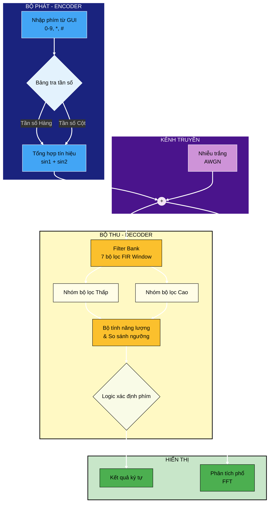

```mermaid
%%{init: {'theme': 'dark', 'themeVariables': { 'edgeLabelBackground':'#333', 'tertiaryColor': '#fff'}}}%%
graph TD
    %% --- ĐỊNH NGHĨA CÁC ĐƯỜNG NỐI (LINK STYLE) TẠI ĐÂY --- %%
    %% Làm cho TẤT CẢ các đường nối có màu trắng sáng và dày lên để nổi bật
    linkStyle default stroke:#FFFFFF,stroke-width:2.5px,fill:none;
    
    %% --- KHỐI PHÁT (ENCODER) --- %%
    subgraph Transmitter [BỘ PHÁT - ENCODER]
        A[Nhập phím từ GUI <br> 0-9, *, #] --> B{Bảng tra tần số}
        B -- Tần số Hàng --> C[Tổng hợp tín hiệu <br> sin1 + sin2]
        B -- Tần số Cột --> C
    end

    %% --- KÊNH TRUYỀN --- %%
    subgraph Channel [KÊNH TRUYỀN]
        C --> D((+))
        E[Nhiễu trắng <br> AWGN] --> D
    end

    %% --- KHỐI THU (DECODER) --- %%
    subgraph Receiver [BỘ THU - DECODER]
        D --> F[Filter Bank <br> 7 bộ lọc FIR Window]
        F --> G[Nhóm bộ lọc Thấp]
        F --> H[Nhóm bộ lọc Cao]
        G --> I[Bộ tính năng lượng <br> & So sánh ngưỡng]
        H --> I
        I --> J{Logic xác định phím}
    end

    %% --- KẾT QUẢ --- %%
    subgraph Result [HIỂN THỊ]
        J --> K[Kết quả ký tự]
        D --> L[Phân tích phổ <br> FFT]
    end

    %% --- ĐỊNH DẠNG MÀU KHỐI (HIGH CONTRAST) --- %%
    %% Transmitter (Xanh dương)
    style Transmitter fill:#1a237e,stroke:#fff,stroke-width:2px,color:#fff
    style A fill:#42a5f5,stroke:#fff,stroke-width:1px,color:#000
    style B fill:#e3f2fd,stroke:#fff,stroke-width:1px,color:#000
    style C fill:#42a5f5,stroke:#fff,stroke-width:1px,color:#000

    %% Receiver (Vàng)
    style Receiver fill:#fff9c4,stroke:#000,stroke-width:2px,color:#000
    style F fill:#fbc02d,stroke:#000,stroke-width:1px,color:#000
    style G fill:#fffde7,stroke:#000,stroke-width:1px,color:#000
    style H fill:#fffde7,stroke:#000,stroke-width:1px,color:#000
    style I fill:#fbc02d,stroke:#000,stroke-width:1px,color:#000
    style J fill:#f9fbe7,stroke:#000,stroke-width:1px,color:#000

    %% Channel (Tím)
    style Channel fill:#4a148c,stroke:#fff,stroke-width:2px,color:#fff
    style D fill:#f3e5f5,stroke:#fff,stroke-width:1px,color:#000
    style E fill:#ce93d8,stroke:#fff,stroke-width:1px,color:#000

    %% Result (Xanh lá)
    style Result fill:#c8e6c9,stroke:#000,stroke-width:2px,color:#000
    style K fill:#4caf50,stroke:#000,stroke-width:1px,color:#000
    style L fill:#4caf50,stroke:#000,stroke-width:1px,color:#000
```
